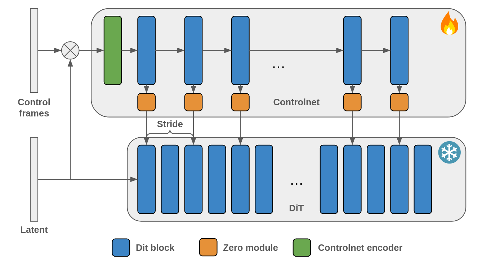

# Dilated Controlnet for Wan2.1


https://github.com/user-attachments/assets/b5d9620f-1d5d-4841-b49f-03fb702140f7


This repo contains the code for dilated controlnet module for Wan2.1 model.  
Dilated controlnet has `stride` parameter. 
<p>
    
</p>

### Models  
Supported models for 1.3B:
- Hed (<a href="https://huggingface.co/TheDenk/wan2.1-t2v-1.3b-controlnet-hed-v1">HF Model Link</a>)  

### How to
Clone repo 
```bash
git clone https://github.com/TheDenk/wan2.1-dilated-controlnet.git
cd wan2.1-dilated-controlnet
```
  
Create venv  
```bash
python -m venv venv
source venv/bin/activate
```
  
Install requirements
```bash
pip install -r requirements.txt
```

### Inference examples
#### Inference with cli
```bash
python -m inference.cli_demo \
    --video_path "resources/physical-4.mp4" \
    --prompt "A balloon filled with water was thrown to the ground, exploding and splashing water in all directions. There were graffiti on the wall, studio lighting, and commercial movie shooting." \
    --controlnet_type "hed" \
    --controlnet_stride 3 \
    --base_model_path Wan-AI/Wan2.1-T2V-1.3B-Diffusers \
    --controlnet_model_path TheDenk/wan2.1-t2v-1.3b-controlnetd-hed-v1
```

#### Inference with Gradio
```bash
python -m inference.gradio_web_demo \
    --controlnet_type "hed" \
    --base_model_path Wan-AI/Wan2.1-T2V-1.3B-Diffusers \
    --controlnet_model_path TheDenk/wan2.1-t2v-1.3b-controlnetd-hed-v1
```
#### Detailed Inference
```bash
python -m inference.cli_demo \
    --video_path "resources/physical-4.mp4" \
    --prompt "A balloon filled with water was thrown to the ground, exploding and splashing water in all directions. There were graffiti on the wall, studio lighting, and commercial movie shooting." \
    --controlnet_type "hed" \
    --base_model_path Wan-AI/Wan2.1-T2V-1.3B-Diffusers \
    --controlnet_model_path TheDenk/wan2.1-t2v-1.3b-controlnetd-hed-v1 \
    --controlnet_weight 0.8 \
    --controlnet_guidance_start 0.0 \
    --controlnet_guidance_end 0.8 \
    --controlnet_stride 3 \
    --num_inference_steps 50 \
    --guidance_scale 5.0 \
    --video_height 480 \
    --video_width 832 \
    --num_frames 81 \
    --negative_prompt "Bright tones, overexposed, static, blurred details, subtitles, style, works, paintings, images, static, overall gray, worst quality, low quality, JPEG compression residue, ugly, incomplete, extra fingers, poorly drawn hands, poorly drawn faces, deformed, disfigured, misshapen limbs, fused fingers, still picture, messy background, three legs, many people in the background, walking backwards" \
    --seed 42 \
    --out_fps 16 \
    --output_path "result.mp4"
```

## Acknowledgements
Original code and models [Wan2.1](https://github.com/Wan-Video/Wan2.1).  


## Citations
```
@misc{TheDenk,
    title={Dilated Controlnet},
    author={Karachev Denis},
    url={https://github.com/TheDenk/wan2.1-dilated-controlnet},
    publisher={Github},
    year={2025}
}
```

## Contacts
<p>Issues should be raised directly in the repository. For professional support and recommendations please <a>welcomedenk@gmail.com</a>.</p>
